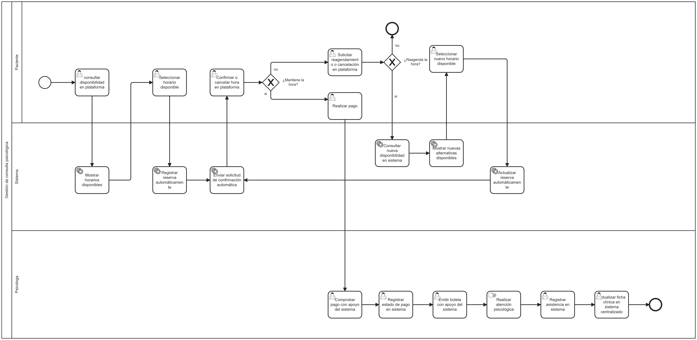

# Análisis de rediseño y propuesta TO-BE
 
## Mejoras identificadas por participante

| Participante | Objetivo | Problema | Mejora deseada |
|---|---|---|---|
| Paciente | Solicitar, confirmar, cambiar o cancelar una hora de atención y cumplir con el proceso de pago correspondiente. | La solicitud, confirmación y cambios de hora dependen de la comunicación por WhatsApp con la secretaria o la psicóloga. | Permitir que el paciente consulte disponibilidad, solicite y gestione sus horas mediante una plataforma de manera más autónoma. |
| Secretaria | Coordinar horas, confirmar asistencia y apoyar la gestión administrativa de los pacientes. | La agenda se administra manualmente en Excel y la confirmación de horas requiere contactar individualmente a los pacientes. | Centralizar la gestión de agenda y reducir las tareas manuales mediante disponibilidad actualizada y confirmaciones automatizadas. |
| Psicóloga | Gestionar su disponibilidad, coordinar y confirmar atenciones, verificar pagos y mantener actualizada la información de sus pacientes. | Debe comprobar pagos mediante comprobantes enviados por WhatsApp, emitir boletas, revisar información en herramientas separadas y gestionar datos confidenciales. | Centralizar la información administrativa y clínica, facilitar la comprobación de pagos y disminuir tareas administrativas repetitivas, manteniendo el resguardo de la información. |
 
## Iniciativas de rediseño
### Iniciativa 1: Autogestión de horas por parte del paciente
- Actividad(es) del AS-IS que afecta: Solicitar hora por WhatsApp, Revisar disponibilidad en Excel, Informar horarios disponibles, Seleccionar horario, Registrar hora en Excel, Revisar nueva disponibilidad en Excel, Informar nuevos horarios disponibles y Registrar nueva hora en Excel.
- Heurística aplicada: Tecnología integral.
- Objetivo o mejora que resuelve: Permitir que el paciente consulte disponibilidad y gestione sus horas de manera más autónoma, reduciendo la dependencia de la secretaria o la psicóloga.
- Efecto esperado:
  - Tiempo: disminución del tiempo de coordinación de horas.
  - Costo: reducción del trabajo administrativo asociado a la gestión manual de agenda.
  - Calidad: menor probabilidad de errores de registro y disponibilidad.
  - Flexibilidad: mayor autonomía para que el paciente gestione sus horas.

### Iniciativa 2: Automatización de la confirmación de horas
- Actividad(es) del AS-IS que afecta: Confirmar asistencia por WhatsApp y Responder confirmación.
- Heurística aplicada: Automatización de tareas.
- Objetivo o mejora que resuelve: Reducir la gestión manual de confirmaciones realizada por la secretaria y la psicóloga.
- Efecto esperado:
  - Tiempo: reducción del tiempo destinado a contactar pacientes.
  - Costo: menor carga administrativa.
  - Calidad: confirmaciones más consistentes y registradas en el sistema.
  - Flexibilidad: posibilidad de responder la confirmación sin depender de contacto directo.

### Iniciativa 3: Centralización de la información de agenda, pagos y pacientes
- Actividad(es) del AS-IS que afecta: Revisar disponibilidad en Excel, Registrar hora en Excel, Registrar nueva hora en Excel, Registrar estado de pago en Excel y Actualizar ficha clínica.
- Heurística aplicada: Integración.
- Objetivo o mejora que resuelve: Evitar que la información administrativa y clínica se gestione mediante herramientas separadas.
- Efecto esperado:
  - Tiempo: menor tiempo de búsqueda y actualización de información.
  - Costo: reducción de tareas duplicadas.
  - Calidad: información más consistente y actualizada.
  - Flexibilidad: acceso centralizado desde una misma plataforma.

### Iniciativa 4: Reducción de contactos administrativos
- Actividad(es) del AS-IS que afecta: Solicitar hora por WhatsApp, Informar horarios disponibles, Confirmar asistencia por WhatsApp e Informar nuevos horarios disponibles.
- Heurística aplicada: Reducción de contacto.
- Objetivo o mejora que resuelve: Disminuir las interacciones manuales necesarias para coordinar una atención.
- Efecto esperado:
  - Tiempo: menos intercambios de mensajes.
  - Costo: menor carga operativa para secretaria y psicóloga.
  - Calidad: menor riesgo de omisiones o errores de comunicación.
  - Flexibilidad: mayor independencia del paciente durante la gestión de su hora.
 
## Diagrama TO-BE

Archivo fuente: [`./diagramas/TO-BE.bpmn`](./diagramas/TO-BE.bpmn)
 
## Actividades que cambian del AS-IS al TO-BE

| Actividad en el AS-IS | Actividad en el TO-BE | Qué cambia |
|---|---|---|
| Solicitar hora por WhatsApp | Consultar disponibilidad en plataforma | El paciente deja de solicitar la hora mediante WhatsApp y accede directamente a la plataforma para iniciar la gestión de su reserva. |
| Recibir solicitud de hora mediante WhatsApp | Registrar solicitud de atención en plataforma | La solicitud deja de recibirse mediante mensajes manuales y pasa a gestionarse directamente dentro del sistema. |
| Revisar disponibilidad en Excel | Mostrar horarios disponibles | La revisión manual de disponibilidad en Excel desaparece. El sistema consulta la disponibilidad registrada y presenta automáticamente los horarios disponibles. |
| Informar horarios disponibles | Mostrar horarios disponibles |La información de horarios deja de depender de comunicación manual, ya que el sistema la presenta automáticamente al paciente. |
| Informar falta de disponibilidad por WhatsApp | Mostrar mensaje de indisponibilidad en plataforma | Cuando no existen horarios disponibles, el sistema informa automáticamente al paciente sin depender de comunicación manual. |
| Seleccionar horario | Seleccionar horario disponible | El paciente mantiene la selección del horario, pero ahora la realiza directamente dentro de la plataforma. |
| Registrar hora en Excel | Registrar reserva automáticamente | El registro manual de la hora en Excel es reemplazado por el registro automático de la reserva en el sistema. |
| Confirmar asistencia por WhatsApp | Enviar solicitud de confirmación automática | La confirmación deja de enviarse manualmente por WhatsApp y pasa a ser enviada automáticamente por el sistema. |
| Responder confirmación | Confirmar o cancelar hora en plataforma | El paciente deja de responder mediante mensajes y confirma o cancela directamente su hora desde la plataforma. |
| Gestionar incumplimiento de confirmación | Registrar estado de confirmación en sistema | El sistema permite registrar si el paciente confirmó o no su asistencia, dejando disponible la información para la gestión de la reserva. |
| Solicitar cambio o cancelación | Solicitar reagendamiento o cancelación en plataforma | El paciente puede solicitar directamente un reagendamiento o cancelación desde la plataforma, sin depender del contacto manual con la secretaria o psicóloga. |
| Revisar nueva disponibilidad en Excel | Consultar nueva disponibilidad en sistema | La búsqueda de nuevas horas deja de realizarse manualmente en Excel y pasa a ser gestionada por el sistema. |
| Informar nuevos horarios disponibles | Mostrar nuevas alternativas disponibles | El sistema presenta automáticamente las alternativas disponibles para reagendar, reemplazando la comunicación manual de nuevos horarios. |
| Seleccionar horario | Seleccionar nuevo horario disponible | El paciente selecciona directamente en la plataforma una nueva alternativa de horario para reagendar su atención. |
| Registrar nueva hora en Excel | Actualizar reserva automáticamente | El cambio de horario deja de registrarse manualmente en Excel y la reserva se actualiza automáticamente en el sistema. |
| Comprobar pago | Comprobar pago con apoyo del sistema | La psicóloga mantiene la responsabilidad de verificar el pago, pero utiliza información centralizada en la plataforma. |
| Registrar estado de pago en Excel | Registrar estado de pago en sistema | El estado del pago deja de registrarse en Excel y pasa a quedar almacenado en la plataforma. |
| Emitir boleta | Emitir boleta con apoyo del sistema | La emisión de la boleta se realiza con apoyo de la plataforma, reduciendo el trabajo administrativo asociado. |
| Realizar atención psicológica | Realizar atención psicológica | La actividad se mantiene sin cambios relevantes, ya que corresponde al servicio principal prestado por la psicóloga. |
| Registrar asistencia en Excel | Registrar asistencia en sistema | La asistencia deja de registrarse en Excel y pasa a almacenarse directamente en la plataforma. |
| Registrar inasistencia en Excel | Registrar inasistencia en sistema | La información de inasistencias queda almacenada centralizadamente para facilitar el seguimiento del paciente. |
| Actualizar ficha clínica | Actualizar ficha clínica en sistema centralizado | La información clínica pasa a registrarse en una plataforma centralizada e integrada con la información administrativa del paciente. |
| Gestionar agenda manualmente como secretaria | Gestionar agenda mediante plataforma | La secretaria deja de coordinar manualmente las horas y utiliza la plataforma para apoyar la gestión de reservas y atención de pacientes. |
